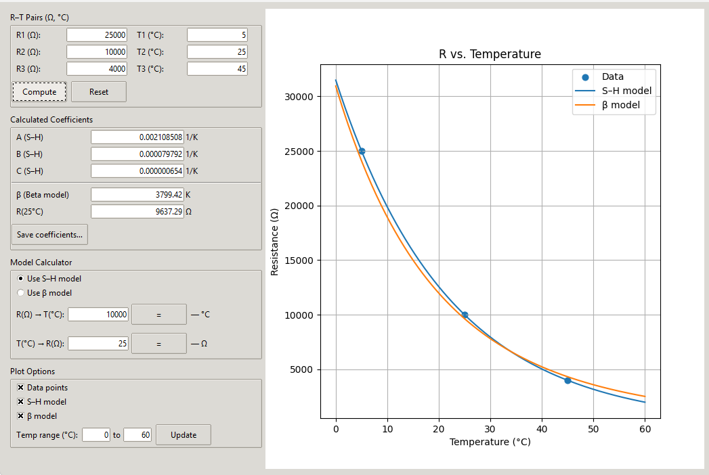
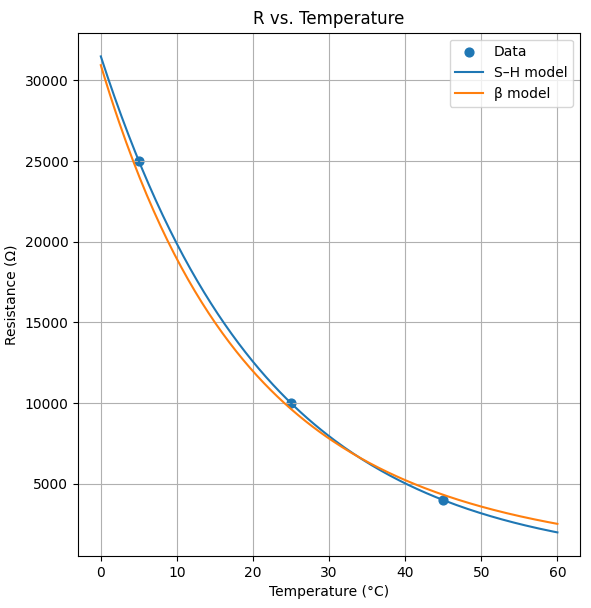
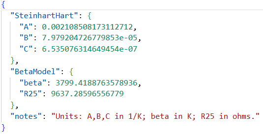

# 🧪 Instrumentação Industrial II  
### Aula Prática 01 — Termistor e Calibração NTC

Este repositório apresenta um **guia teórico e prático sobre termistores**, abrangendo desde seus fundamentos até a aplicação computacional para **calibração de sensores NTC**.  
O conteúdo foi desenvolvido para a disciplina **Instrumentação Industrial II**, mas também é útil para estudantes, técnicos e engenheiros interessados em automação e medição de temperatura.

---

## 📘 Índice

1. [Introdução](#1-introdução)  
2. [Operação Básica](#2-operação-básica)  
3. [Equação de Steinhart–Hart](#3-equação-de-steinharthart)  
4. [Parâmetro B (Modelo Beta)](#4-parâmetro-b-modelo-beta)  
5. [Ferramenta Prática: NTC Thermistor Calibrator](#5-ferramenta-prática-ntc-thermistor-calibrator)  
6. [Considerações Finais](#6-considerações-finais)  
7. [Referências](#7-referências)

---

## 1. Introdução

Um **termistor** é um resistor sensível à temperatura, cuja resistência elétrica varia de acordo com a variação térmica. O termo combina as palavras *“temperatura”* e *“resistor”*.  
Esses dispositivos são amplamente empregados em instrumentação, controle de processos, eletrônica embarcada e aplicações laboratoriais.

**Principais usos de termistores:**
- Medição de temperatura em ambientes industriais e laboratoriais.  
- Controle térmico em sistemas eletrônicos.  
- Limitação de corrente de partida.  
- Proteção contra sobrecorrente.

### Tipos de Termistores

- **NTC (Negative Temperature Coefficient):** resistência diminui com o aumento da temperatura.  
- **PTC (Positive Temperature Coefficient):** resistência aumenta com o aumento da temperatura.

**Figura 1: Aparência de um termistor**  


**Figura 2: Símbolo de um termistor**  


---

## 2. Operação Básica

A variação de resistência em função da temperatura pode ser expressa pela equação linear:

```bash
ΔR = k * ΔT
```

Onde:  
- `ΔR`: variação da resistência;  
- `k`: coeficiente de temperatura;  
- `ΔT`: variação da temperatura.

Os termistores são classificados de acordo com o sinal de `k`:  
- `k` positivo → PTC  
- `k` negativo → NTC  

---

## 3. Equação de Steinhart–Hart

Para faixas mais amplas de temperatura, o comportamento do termistor é descrito de forma mais precisa pela equação de **Steinhart–Hart**:

```bash
1/T = a + b * ln(R) + c * (ln(R))^3
```

Onde:  
- `T`: temperatura absoluta (Kelvin);  
- `R`: resistência (ohms);  
- `a`, `b`, `c`: constantes características do sensor.  

Essa equação é amplamente usada em aplicações de alta precisão, com erro inferior a 0,02 °C.

---

## 4. Parâmetro B (Modelo Beta)

Uma versão simplificada da equação é o **modelo Beta (β)**, expresso por:

```bash
R = R0 * exp[B * (1/T - 1/T0)]
```

Onde:  
- `R0`: resistência a uma temperatura de referência (geralmente 25 °C);  
- `B`: constante beta;  
- `T`: temperatura atual (Kelvin).  

Esse modelo é prático para cálculos rápidos e aproximações de comportamento NTC.

---

## 5. Ferramenta Prática: NTC Thermistor Calibrator

Para complementar a parte teórica, este repositório inclui o software **NTC Thermistor Calibrator**, desenvolvido em **Python (Tkinter + Matplotlib)**, que permite **calcular e visualizar os coeficientes Steinhart–Hart e Beta** com base em medições experimentais.

### 🔧 Funcionalidades

- Cálculo automático dos coeficientes **A**, **B**, **C**, **β** e **R25**;  
- Conversão bidirecional (`R ↔ T`);  
- Gráficos interativos comparando os modelos Steinhart–Hart e Beta;  
- Exportação de coeficientes em `.json`;  
- Interface simples e responsiva.

### 🖥️ Interface principal

  
**Figura 3.** Interface do software, com três pares R–T e gráfico “R vs. Temperature”.  
Os pontos azuis representam os dados experimentais e as curvas mostram os modelos ajustados.

> 💡 *Como gerar a figura:*  
> Execute o programa (`python ntc_calibrator.py`), insira os valores padrão (`25000 Ω @ 5 °C`, `10000 Ω @ 25 °C`, `4000 Ω @ 45 °C`) e clique em **Compute**.  

---

### 📈 Comparação entre Modelos

  
**Figura 4.** Comparação entre o modelo **Steinhart–Hart** (azul) e o **modelo β** (laranja), de 0 °C a 60 °C.

---

### 🧾 Exportação dos Coeficientes

  
**Figura 5.** Exemplo de arquivo `ntc_coeffs.json` gerado automaticamente com os parâmetros de calibração.

---

### 🚀 Execução

```bash
python ntc_calibrator.py
```

**Requisitos:**
- Python 3.8+  
- Tkinter  
- NumPy  
- Matplotlib  

**Arquivo-fonte:** [`ntc_calibrator.py`](python/ntc_calibrator.py)

---

## 6. Considerações Finais

O estudo dos **termistores NTC e PTC** oferece uma base sólida para compreender fenômenos térmicos em sistemas eletrônicos e industriais.  
Com o uso do software de calibração, é possível obter **curvas precisas e modelos matemáticos aplicáveis** tanto no ambiente acadêmico quanto em projetos de automação.

---

## 7. Referências

- Apostila de Instrumentação Industrial II – UFU  
- Steinhart, J.S. & Hart, S.R. (1968). *Calibration curves for thermistors.* Deep-Sea Research, 15(4), 497–503.  
- [Documentação do Python](https://docs.python.org/3/)  
- [Tkinter Reference](https://docs.python.org/3/library/tkinter.html)  
- [Matplotlib Documentation](https://matplotlib.org/stable/index.html)  
- [Teoria dos Termistores – Wikipedia](https://pt.wikipedia.org/wiki/Termistor)
